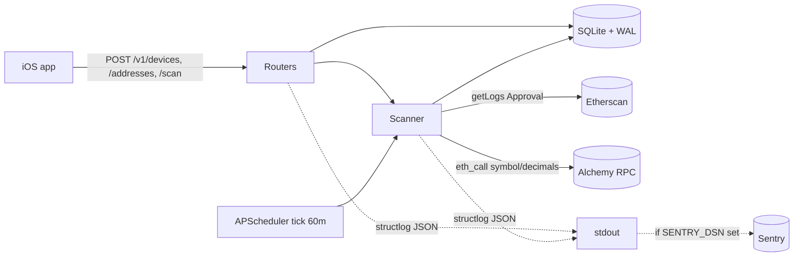
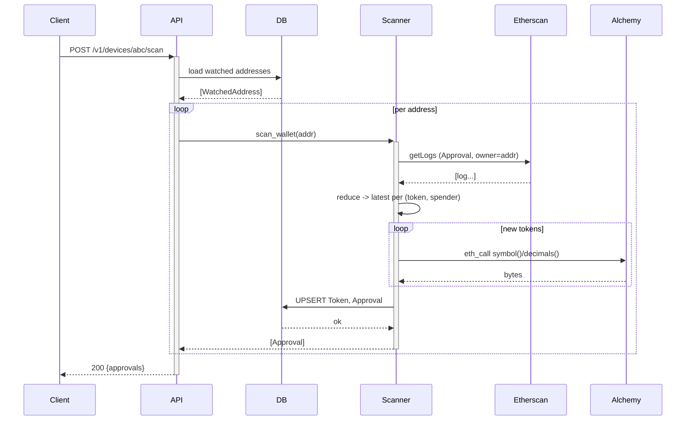
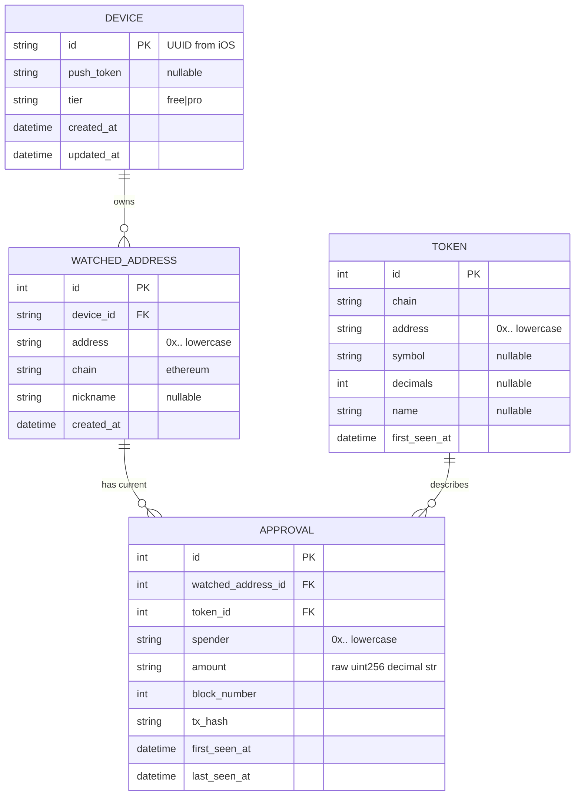

# Aegis — Week 1 Backend Design

**Date:** 2026-05-11
**Scope:** Week 1 backend deliverable per PRD §8
**Status:** Approved, ready for implementation planning

## Context

The Aegis PRD (`PRD.md`) defines an 8-week solo build of a read-only iOS crypto wallet security monitor. Week 1's backend deliverable per §8 is: *"FastAPI skeleton, SQLite schema, Etherscan + Alchemy clients, single-wallet scan job."*

The repo is greenfield (only `PRD.md` and `.claude/skills/`). The dev environment is Linux + Python 3.11 with no Xcode, so the parallel Week 1 iOS work (Swift/SwiftUI ramp-up) is deferred to a macOS machine and not part of this design.

User decisions locked during brainstorming:

| Decision | Choice | Why |
|---|---|---|
| Scope | Week 1 backend only | iOS needs macOS; not available |
| Repo layout | Monorepo with `backend/` subfolder | Future `ios/` sibling; clean separation |
| Package manager | `uv` | Fast modern Python tooling; single `pyproject.toml` |
| API keys | `.env` placeholders + mocked HTTP in tests | Greenfield; no real keys yet; deterministic tests |
| Scan approach | Etherscan `getLogs` for `Approval` events | Used by revoke.cash; one call per chain per scan; cheap |
| Data model | Snapshot table only (no event log) | YAGNI; week-3 diffing reads current state |
| Migrations | `Base.metadata.create_all()` now, Alembic in week 2 | Schema barely exists; ceremony unwarranted yet |
| ETH lib | `eth_utils` only | Small dep (keccak + address validation); no full web3.py |
| API versioning | `/v1` prefix from day 1 | Stable contract for iOS client |
| Scan trigger | API endpoint + APScheduler tick every 60min | Matches PRD literal "single-wallet scan job" + manual testing |
| Scan window | Full history every scan | Simple; most wallets <1000 lifetime Approvals |
| Token metadata | Cache eagerly on first sight | Week 3 health-score gets decimals "for free" |
| Logging | structlog (JSON in prod) | Easy to grep; integrates with stdlib bridge |
| Sentry | Scaffold now, opt-in via `SENTRY_DSN` | Zero cost when unset; ready for week-6 deploy |
| Address validation | Strict via `eth_utils.is_address` in Pydantic | Catches EIP-55 checksums; normalizes lowercase |

## 1. Architecture overview

A single FastAPI process that:
1. Accepts device + watched-address registrations from the iOS app.
2. Scans each watched wallet for ERC-20 Approval events on Ethereum mainnet, on a 60-min APScheduler tick and on demand via API.
3. Persists current allowance state per `(wallet, token, spender)` into SQLite (WAL mode).
4. Caches discovered token metadata (symbol, decimals) on first sight.

Stack: FastAPI + Uvicorn · SQLAlchemy 2.x async + aiosqlite + WAL · httpx async · APScheduler in-process · structlog · Sentry opt-in · tenacity for retry.

### High-level



### On-demand scan sequence



## 2. Repo layout

```
backend/
├── pyproject.toml
├── uv.lock
├── .env.example
├── .gitignore
├── README.md
├── ruff.toml
├── src/aegis/
│   ├── __init__.py
│   ├── main.py          # FastAPI app + lifespan + scheduler start/stop
│   ├── config.py        # pydantic-settings Settings
│   ├── logging.py       # structlog config
│   ├── observability.py # Sentry init (opt-in)
│   ├── db.py            # async engine, session, WAL pragma
│   ├── models.py        # Device, WatchedAddress, Token, Approval
│   ├── schemas.py       # Pydantic I/O + EthAddress type
│   ├── eth.py           # APPROVAL_TOPIC, address helpers (eth_utils)
│   ├── scheduler.py     # APScheduler + scan_all job
│   ├── scanner.py       # scan_wallet() + per-wallet lock
│   ├── clients/
│   │   ├── __init__.py
│   │   ├── base.py      # httpx factory + tenacity retry
│   │   ├── alchemy.py   # eth_call, ERC-20 metadata
│   │   └── etherscan.py # getLogs Approval parser
│   └── api/
│       ├── __init__.py
│       ├── deps.py      # DB session + settings deps
│       ├── healthz.py
│       └── devices.py
└── tests/
    ├── __init__.py
    ├── conftest.py
    ├── fixtures/
    │   ├── etherscan_logs_simple.json
    │   ├── etherscan_logs_empty.json
    │   └── alchemy_token_metadata.json
    ├── test_eth_helpers.py
    ├── test_clients_etherscan.py
    ├── test_clients_alchemy.py
    ├── test_scanner.py
    ├── test_healthz.py
    ├── test_devices_api.py
    ├── test_addresses_api.py
    └── test_scan_api.py
```

## 3. Data model



Constraints:
- `UNIQUE(device_id, address, chain)` on WatchedAddress
- `UNIQUE(chain, address)` on Token
- `UNIQUE(watched_address_id, token_id, spender)` on Approval

SQLite engine setup: enable `journal_mode=WAL`, `synchronous=NORMAL`, `foreign_keys=ON` via a `connect` event listener on `engine.sync_engine` (the async engine wraps it).

Migrations: `Base.metadata.create_all()` invoked in app lifespan startup. Alembic deferred to week 2.

All address-shaped columns stored lowercase 0x-prefixed.

## 4. API surface (v1)

| Method | Path | Body | Response | Notes |
|---|---|---|---|---|
| GET | `/v1/healthz` | — | `{"status":"ok"}` | Liveness, no DB hit |
| POST | `/v1/devices` | `{device_id, push_token?, tier?}` | 201 Device | Upsert by id |
| POST | `/v1/devices/{id}/addresses` | `{address, chain?, nickname?}` | 201 WatchedAddress | Idempotent on UNIQUE; returns existing row on duplicate |
| GET | `/v1/devices/{id}/addresses` | — | `{addresses:[]}` | |
| DELETE | `/v1/devices/{id}/addresses/{addr_id}` | — | 204 | |
| POST | `/v1/devices/{id}/scan` | — | `{approvals:[]}` | Synchronous scan all addresses for device |

`EthAddress` is a custom Pydantic type that runs `eth_utils.is_address(value)` for validation and normalizes to lowercase on serialize. Used in both request and response schemas.

Errors normalize to:
```json
{"error": {"code": "string", "message": "string", "details": "optional"}}
```
via a single FastAPI exception handler.

## 5. Scanner pipeline

`scan_wallet(session, watched: WatchedAddress) -> list[Approval]`:

1. Call `etherscan.get_approval_logs(watched.address, watched.chain)` — returns chronologically-ordered events.
2. Reduce events into `{(token, spender): latest_event}` — last write wins because logs are chronological.
3. For each unique `token` in the reduced map, ensure a `Token` row exists; if not, fetch `symbol()` + `decimals()` via Alchemy `eth_call` and insert.
4. UPSERT each `(watched_address_id, token_id, spender)` into `Approval`. Updates: `amount`, `block_number`, `tx_hash`, `last_seen_at`. Inserts: same + `first_seen_at = now()`.
5. Return resulting Approval list.

Concurrency safety: `weakref.WeakValueDictionary[(device_id, address, chain), asyncio.Lock]` in `scanner.py` serializes overlapping scans for the *same* wallet without blocking *different* wallets.

Event topic constant in `eth.py`, computed at import:
```python
APPROVAL_TOPIC = "0x" + eth_utils.keccak(text="Approval(address,address,uint256)").hex()
# 0x8c5be1e5ebec7d5bd14f71427d1e84f3dd0314c0f7b2291e5b200ac8c7c3b925
```
`test_eth_helpers` asserts against the literal to catch any regression.

## 6. External clients

### Etherscan (`clients/etherscan.py`)
- `EtherscanClient(http: httpx.AsyncClient, api_key: str, base_url: str)`.
- `async def get_approval_logs(owner: str, from_block: int = 0, to_block: int | str = "latest") -> list[ApprovalEvent]`.
- Calls `module=logs&action=getLogs&topic0=<APPROVAL_TOPIC>&topic1=<owner_padded_to_32_bytes>`.
- Paginates in 1000-log pages until the response has fewer than 1000 entries.
- Raises `EtherscanError` on `{"status":"0", "message": ...}` payloads unless message is `"No records found"` (which returns `[]`).

`ApprovalEvent` dataclass: `token: str`, `spender: str`, `amount: str` (raw uint256 decimal), `block_number: int`, `tx_hash: str`, `log_index: int`.

### Alchemy (`clients/alchemy.py`)
- `AlchemyClient(http: httpx.AsyncClient, api_key: str, base_url_tmpl: str)`.
- `async def eth_block_number() -> int`
- `async def eth_call(to: str, data: str, block: str = "latest") -> str`
- `async def get_erc20_metadata(token_address: str) -> TokenMetadata` — composes two `eth_call`s:
  - `symbol()` selector `0x95d89b41` → decode ABI string
  - `decimals()` selector `0x313ce567` → decode `uint8`
  - On revert (response contains `{"error": ...}`): falls back to `TokenMetadata(symbol=None, decimals=None)`.

### Shared (`clients/base.py`)
- Singleton `httpx.AsyncClient` factory (timeout from `HTTP_TIMEOUT_SECONDS`, http2 enabled).
- Each public client method wrapped with `tenacity.retry(stop=stop_after_attempt(3), wait=wait_exponential(multiplier=0.5, max=4), retry=retry_if_exception_type((httpx.TransportError, RateLimitedError)))`.

## 7. Background scheduler

`scheduler.py`:
- Builds an `AsyncIOScheduler` with a single job in week 1:
  - `id="scan_all"`, `IntervalTrigger(minutes=SCAN_INTERVAL_MINUTES)` (default 60).
  - Calls `scan_all_watched_addresses(session_factory)` which iterates all `WatchedAddress` rows and runs `scan_wallet` for each, gated by `asyncio.Semaphore(SCAN_CONCURRENCY)` (default 4) to be polite to Etherscan's 5 req/sec free-tier limit.
- Wired in `main.py` lifespan: `scheduler.start()` on startup, `scheduler.shutdown(wait=False)` on shutdown.
- Disabled in tests by `SCHEDULER_ENABLED=false`.

## 8. Logging & observability

`logging.py`:
- structlog processors: `add_log_level`, `TimeStamper(fmt="iso")`, `add_logger_name`, `contextvars.merge_contextvars`, then either `JSONRenderer` (`LOG_FORMAT=json`) or `ConsoleRenderer` (`console`).
- Bridges stdlib `logging` via `structlog.stdlib.ProcessorFormatter` so uvicorn / SQLAlchemy / httpx all render through structlog.
- FastAPI middleware binds a fresh `request_id` (uuid4) and `method` / `path` into `structlog.contextvars` for the duration of each request.
- Scanner wraps each `scan_wallet` call with `bound_contextvars(device_id=..., address=..., chain=...)`.

`observability.py`:
```python
def init_sentry(settings: Settings) -> None:
    if not settings.sentry_dsn:
        return
    sentry_sdk.init(
        dsn=settings.sentry_dsn,
        environment=settings.env,
        traces_sample_rate=0.0,
        send_default_pii=False,
        integrations=[FastApiIntegration(), AsyncioIntegration(), SqlalchemyIntegration()],
    )
```
Called from `main.py` lifespan startup. Zero cost when `SENTRY_DSN` unset.

## 9. Error handling

Single exception handler maps every error to `{"error": {"code", "message", "details"?}}`.

| Exception | HTTP | code |
|---|---|---|
| `InvalidAddressError` | 422 | `invalid_address` |
| `NotFoundError` | 404 | `not_found` |
| `EtherscanError` (rate-limited) | 503 | `upstream_rate_limited` |
| `EtherscanError` (other) | 502 | `upstream_etherscan` |
| `AlchemyError` | 502 | `upstream_alchemy` |
| `ConfigError` (missing API key on scan) | 503 | `not_configured` |
| `RequestValidationError` (pydantic) | 422 | `validation_error` |
| catch-all `Exception` | 500 | `internal_error` (full traceback to logs + Sentry) |

Tenacity retry inside client wrappers absorbs transient failures before they bubble. `healthz` never raises — even if DB is unavailable it returns 200 (process liveness only); deeper readiness probe deferred to week 6.

## 10. Configuration

`config.py` uses `pydantic-settings.BaseSettings` reading from environment + `.env`.

| Env var | Default | Purpose |
|---|---|---|
| `DATABASE_URL` | `sqlite+aiosqlite:///./aegis.db` | SQLAlchemy URL |
| `ETHERSCAN_API_KEY` | `""` | Required for scans |
| `ETHERSCAN_BASE_URL` | `https://api.etherscan.io/api` | Override in tests |
| `ALCHEMY_API_KEY` | `""` | Required for token metadata |
| `ALCHEMY_BASE_URL_TMPL` | `https://eth-mainnet.g.alchemy.com/v2/{api_key}` | Override in tests |
| `LOG_LEVEL` | `INFO` | |
| `LOG_FORMAT` | `console` | `console` or `json` |
| `SCHEDULER_ENABLED` | `true` | False in tests |
| `SCAN_INTERVAL_MINUTES` | `60` | Week 1 default |
| `SCAN_CONCURRENCY` | `4` | Per-tick semaphore |
| `HTTP_TIMEOUT_SECONDS` | `10` | httpx default |
| `SENTRY_DSN` | `""` | Empty disables |
| `ENV` | `development` | Sentry tag |

`.env.example` ships with empty placeholders. `.gitignore` excludes `.env`, `.venv/`, `__pycache__/`, `*.db`, `*.db-wal`, `*.db-shm`, `.pytest_cache/`, `.ruff_cache/`, `htmlcov/`.

## 11. Testing strategy

Tooling: `pytest`, `pytest-asyncio` (mode=auto), `pytest-httpx`, `pytest-cov`, `ruff`.

`conftest.py` fixtures:
- `settings` — `Settings` with test overrides (in-memory DB, scheduler off, placeholder keys, fake base URLs).
- `engine` (session-scoped) + `db_session` (function-scoped, rolled back).
- `app` — FastAPI app built with test settings; lifespan honored (scheduler off).
- `client` — `httpx.AsyncClient(transport=ASGITransport(app=app), base_url="http://test")`.
- `httpx_mock` from `pytest-httpx` for outbound HTTP.
- `load_fixture(name)` helper for `tests/fixtures/*.json`.

Test matrix:

| File | What it asserts |
|---|---|
| `test_eth_helpers` | `APPROVAL_TOPIC` matches hardcoded literal · address normalization roundtrip · invalid addresses raise. |
| `test_clients_etherscan` | URL/params built correctly (topic0, padded topic1, apikey) · fixture → N parsed `ApprovalEvent` · pagination triggered on 1000-log response · `{status:0, message:"NOTOK"}` raises. |
| `test_clients_alchemy` | JSON-RPC payload (`jsonrpc:"2.0"`, id, method, params) · symbol/decimals hex decoded · revert → `(None, None)`. |
| `test_scanner` | 3-log fixture (2 distinct pairs + 1 amount update on pair A) → 2 Approval rows · re-scan keeps `first_seen_at`, bumps `last_seen_at` · Token row created once · per-wallet lock serializes overlapping calls. |
| `test_healthz` | 200 + payload. |
| `test_devices_api` | Create new · upsert preserves `created_at`, updates `updated_at` · `tier` defaults `free`, persists when set. |
| `test_addresses_api` | EIP-55 mixed-case input accepted, stored lowercase · garbage → 422 `invalid_address` · idempotent re-add returns existing row · delete → 204. |
| `test_scan_api` | Mocked Etherscan + Alchemy → 200 with expected approvals · DB has expected rows · missing key → 503 `not_configured`. |

CI-equivalent: `uv run ruff check . && uv run ruff format --check . && uv run pytest -q --cov=aegis --cov-report=term-missing --cov-fail-under=85`.

## 12. Verification

From `backend/`:

1. `uv sync` → installs deps, creates `.venv`, writes `uv.lock`.
2. `uv run ruff check .` → no findings.
3. `uv run ruff format --check .` → clean.
4. `uv run pytest -q` → all green, coverage ≥85%.
5. `cp .env.example .env` (leave keys blank).
6. `SCHEDULER_ENABLED=false uv run uvicorn aegis.main:app --port 8000` → server boots; structlog emits "startup complete".
7. `curl localhost:8000/v1/healthz` → `{"status":"ok"}`.
8. Smoke without keys:
   ```bash
   curl -X POST localhost:8000/v1/devices -H 'content-type: application/json' \
        -d '{"device_id":"test-1"}'
   curl -X POST localhost:8000/v1/devices/test-1/addresses \
        -H 'content-type: application/json' \
        -d '{"address":"0xd8dA6BF26964aF9D7eEd9e03E53415D37aA96045"}'
   curl localhost:8000/v1/devices/test-1/addresses
   curl -X POST localhost:8000/v1/devices/test-1/scan
   ```
   Expected: 201, 201, 200 with normalized lowercase address; `/scan` returns 503 `{"error":{"code":"not_configured","message":"ETHERSCAN_API_KEY missing"}}`. Confirms env wiring + error contract end-to-end without burning a real API key.

## 13. Out of scope (later weeks per PRD §8)

- Multi-chain support: Base, Arbitrum, Optimism, Polygon, BSC (week 2)
- GoPlus malicious-address + honeypot detection (week 2)
- Alembic migrations (week 2)
- Health-score algorithm + cross-scan diffing (week 3)
- FCM push + APNs templates + push token plumbing (week 4)
- Free-vs-Pro scan-frequency tiers, per-tier rate limits (week 5)
- Production deploy: systemd, Caddy, SQLite WAL backup, prod log shipping (week 6)
- iOS Swift/SwiftUI prototype (parallel track, requires macOS)
